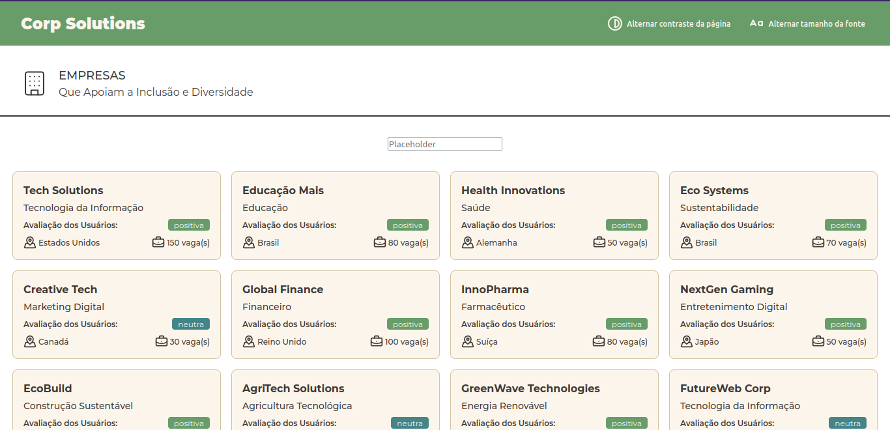

# Corp Solutions - Sistema de Vagas

## 💻 Sobre o projeto

O projeto é uma plataforma desenvolvida pela equipe **_FE-3_** durante o AdaHack, o Hackathon da ADA. Nosso objetivo, em consonância com o [**desafio proposto**](./readme/case-adahack.md) no hackathon, é criar um espaço interativo que fomente a colaboração entre empresas e usuários para promover a diversidade, inclusão e aprimoramento da cultura organizacional.

A plataforma proporciona um ambiente propício para um diálogo aberto e inclusivo entre empresas e a comunidade, incentivando práticas mais diversificadas e inclusivas no ambiente de trabalho. Os recursos da plataforma incluem a possibilidade de os colaboradores acompanharem vagas de emprego, fornecerem feedbacks sobre as empresas e avaliarem a experiência de inclusão e diversidade durante o processo de recrutamento e integração.

Por outro lado, os recrutadores podem usar a plataforma para publicar oportunidades de emprego, gerenciar candidaturas e acessar o feedback dos colaboradores sobre suas experiências de recrutamento e integração na empresa.

Além disso, a plataforma oferece recursos adicionais, como análises de dados para ajudar as empresas a identificar áreas de melhoria em suas práticas de recrutamento e inclusão. Essas ferramentas são fundamentais para promover ambientes de trabalho mais inclusivos e diversificados, alinhados com os valores e objetivos das empresas participantes.

## 🎨 Layout

O layout da aplicação está disponível no Figma:

[](https://www.figma.com/file/MbbxQeL72GFB4CvAjdGiGO/Projeto-Hackathon---Corp-Solutions?type=design&node-id=2197%3A3&mode=design&t=k4f5WlzuX1WF8h1u-1)



## 🚀 Como executar o projeto

### Pré-requisitos

Antes de começar, você vai precisar ter instalado em sua máquina as seguintes ferramentas:

- [Git](https://git-scm.com)
- [Node.js](https://nodejs.org/en/).
- [Json Server](https://github.com/typicode/json-server)

💡 Além disto é bom ter um editor para trabalhar com o código como [VSCode](https://code.visualstudio.com/)

### Executando a aplicação

```bash

# Clone este repositório
$ git clone https://github.com/joaolucasMota/adahack-time-fe-3

# Acesse a pasta do projeto no seu terminal/cmd
$ cd adahack-time-fe-3

# Instale as dependências
$ npm install

# Inicie o json-server para servir o arquivo db.json (incluído no repositório)
$ npm run server

# Execute a aplicação em modo de desenvolvimento
$ npm run dev

# A aplicação será aberta na porta:5173 - acesse http://localhost:5173

```

## 🛠 Tecnologias Utilizadas

As seguintes ferramentas foram usadas na construção do projeto:

### Website

- **[React](https://react.dev/)**
- **[TypeScript](https://www.typescriptlang.org/)**
- **[React Router Dom](https://reactrouter.com/en/main)**
- **[Axios](https://github.com/axios/axios)**
- **[Styled-components](https://styled-components.com)**
- **[JSON Server](https://github.com/typicode/json-server)**
- **[Firebase](https://firebase.google.com/docs?hl=pt&authuser=0&_gl=1*x2p35x*_ga*MTUzOTEwOTUwLjE3MTMzMTkyODg.*_ga_CW55HF8NVT*MTcxMzMxOTI4OS4xLjEuMTcxMzMxOTI5OC41MS4wLjA.)**
- **[TanStack Query](https://tanstack.com/query/latest/docs/framework/react/overview)**
- **[Radix UI](https://www.radix-ui.com)**
- **[Vite](https://vitejs.dev)**

### Utilitários

- Protótipo: **[Figma](https://www.figma.com/)** → **[Corp Solutions](https://www.figma.com/file/MbbxQeL72GFB4CvAjdGiGO/Projeto-Hackathon---Corp-Solutions?type=design&node-id=2197%3A3&mode=design&t=k4f5WlzuX1WF8h1u-1)**
- Editor: **[Visual Studio Code](https://code.visualstudio.com/)**
- Ícones: **[Lucide](https://lucide.dev)**
- Fontes: **[Montserrat](https://fonts.google.com/specimen/Montserrat)**

## 👨‍💻 Membros da Equipe

Durante o desenvolvimento do projeto, enfrentamos o desafio de gerenciar eficientemente o tempo, especialmente devido aos prazos rigorosos estabelecidos. Para superar essa dificuldade, adotamos estratégias de planejamento e acompanhamento das tarefas utilizando o recurso [**Projects**](https://github.com/users/joaolucasMota/projects/4) do GitHub. Além disso, realizamos reuniões diárias às 19h no canal designado para nossa turma no servidor da Ada, promovendo a comunicação e a colaboração entre os membros da equipe.

Essas práticas fortaleceram a coesão da equipe, melhoraram a qualidade do código e contribuíram significativamente para o sucesso do projeto, permitindo que enfrentássemos os desafios de forma eficaz e entregássemos uma solução de alta qualidade dentro dos prazos estabelecidos.

---

<table>
  <tr>
    <td align="center">
      <a href="https://github.com/ananeres">
        <br />
        <sub>
          <b>Ana Patrícia</b>
        </sub>
      </a>
    </td>
    <td align="center">
      <a href="https://github.com/juninho-Oliveira">
        <br />
        <sub>
          <b>Damião Júnior</b>
        </sub>
      </a>
    </td>
    <td align="center">
      <a href="https://github.com/emanoelantonio">
        <br />
        <sub>
          <b>Emanoel Antônio</b>
        </sub>
      </a>
    </td>
  </tr>
  <tr>
    <td align="center">
      <a href="https://github.com/guimattos91">
        <br />
        <sub>
          <b>Guilherme Mattos</b>
        </sub>
      </a>
    </td>
    <td align="center">
      <a href="https://github.com/joaolucasMota">
        <br />
        <sub>
          <b>João Lucas</b>
        </sub>
      </a>
    </td>
    <td align="center">
      <a href="https://github.com/josephmatheus">
        <br />
        <sub>
          <b>Joseph Matheus</b>
        </sub>
      </a>
    </td>
  </tr>
  <tr>
    <td align="center">
      <a href="https://github.com/RodrigoSilva5">
        <br />
        <sub>
          <b>Rodrigo Silva</b>
        </sub>
      </a>
    </td>
    <td align="center">
      <a href="https://github.com/sarahguerreiro">
        <br />
        <sub>
          <b>Sarah Guerreiro</b>
        </sub>
      </a>
    </td>
    <td align="center">
      <a href="https://github.com/BR-Darkness">
        <br />
        <sub>
          <b>Vitor Galindo</b>
        </sub>
      </a>
    </td>
  </tr>
</table>

---

## Próximos Passos

- [ ] Migrar a maneira com que os dados são salvos para um Firebase.
- [ ] Criar uma área de cadastro e edição de empresas para melhorar a interação com os usuários.
- [ ] Melhoria no formulário de cadastro.

## 📝 Licença

Este projeto está sob a licença MIT. Veja o arquivo [LICENSE](./LICENSE) para mais detalhes.
